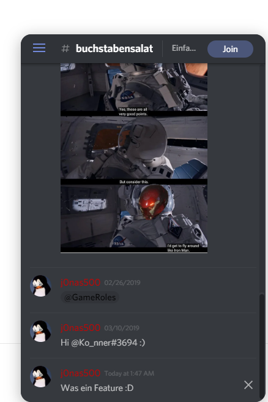

Ab sofort seht ihr alle Nachrichten die im Chat-Kanal "#buchstabensalat" verschickt werden, auf jeder Website um immer mit der Community connected zu sein. In diesem Post erläutere ich kurz das Feature und zeige euch wie ich es eingerichtet habe.

Wie Du vielleicht schon mitbekommen hast befindet sich unten rechts das Logo von Discord während dadrüber, wenn Nachrichten verschickt werden, diese eingeblendet werden. Auf das Discord Logo draufgeklickt, seht ihr den ganzen Chat und könnt zwischen diese Switchen.  


Dazu habe ich [widgetbot.io](https://about.widgetbot.io/) verwendet. Ich habe, weil die Webseites von den offizielen Bots down sind, den Bot von [DisWeb](https://deploys.io/docs/disweb/) genommen. Es gebe auch die Möglichkeit, den Bot selbst zu hosten da es [OpenSource](https://github.com/fluidsonic/widgetbot) ist. Werde ich auch machen falls der Bot mal nicht mehr funktionieren sollte.

Nachdem man den Bot also auf seinen Server eingeladen hat, geht es jetzt an die Webseite. Um es so wie bei uns zu haben muss dieser Code-Snippet kurz vor dem `</head>` Tag sein:
```js
<script src="https://cdn.jsdelivr.net/npm/@widgetbot/crate@3" async defer>
  const button = new Crate({
    server: '299881420891881473',
    channel: '355719584830980096',
    shard: 'https://disweb.deploys.io'
  })
</script>
```
Die Variabeln die verändert werden müssen sind einmal der `server` mit Deiner ServerID, der `channel` mit der ChannelID, von dem Chat der angezeigt werden soll. Und dann noch der `shard` Dies sollte der zum Bot gehörendem `shard` sein. Also wenn Du den selben Bot verwendest wie wir, dann kannst du den `shard` so lassen, sonst musst du einen anderen verwenden. Und das wars!

Willst du den Discord Chat anders einbetten, beispielsweise den kompletten Chat direkt anzeigen, dann sieh dir gerne auch noch diese Beispiele [hier](https://docs.widgetbot.io/embed/crate/examples/) an.
